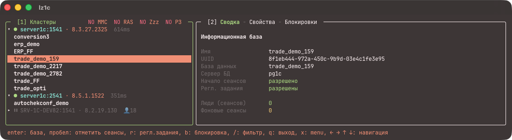

<div align="center">

# 🖥️ lazy1c

**A lazygit/lazydocker-style TUI for administering 1C:Enterprise server clusters**

[](https://github.com/0x3654/lazy1c/releases)
[](#engines--protocol-notes)
[](https://go.dev)
[](#cross-compilation)
[](LICENSE)

[Features](#features) · [Install](#install) · [Quick start](#quick-start) ·
[Configuration](#configuration) · [Key bindings](#key-bindings) ·
[CLI](#cli-for-scripts) · [Engines](#engines--protocol-notes) ·
[Русская версия](#lazy1c--tui-для-администрирования-1спредприятие)



</div>

---

lazy1c talks to 1C clusters **natively** — the RAS protocol (TCP :1545) for
8.3/8.5 and a reverse-engineered MMC protocol (ragent :1540) for 8.2 — with
**no `rac` utility, no docker access and no 1C platform installed** on your
machine. One static Go binary.

## Features

| Area | What you get |
|---|---|
| Cluster tree | clusters → infobases → sessions, live polling, per-cluster pause |
| Session ops | terminate (`d`), bulk via `✓` marks with a preview confirm |
| Infobase props | scheduled-jobs deny (`r`), session lock (`b`) with confirmation |
| Filters | text filter scoped by tree level; visibility toggles (`x` menu) |
| Engines | RAS 8.3/8.5, MMC 8.2 (reverse-engineered), MMC 8.3 fallback |
| Read-only mode | hard flag or menu toggle — blocks every cluster mutation |
| Scripting | `lazy1c ctl …` CLI, tab-separated output, explicit `-yes` for CI |
| Safety | destructive actions always confirmed; state badges in the header |

## Install

Grab a binary from [releases](https://github.com/0x3654/lazy1c/releases)
(not published yet — see [Build from source](#build-from-source)) or build
it yourself. No dependencies beyond the binary.

## Build from source

Builds and tests run **in a container** (golang:1.27-alpine); module and
build caches live in docker volumes, the host stays clean:

```bash
git clone https://github.com/0x3654/lazy1c.git && cd lazy1c
make build        # macOS/arm64 binary via cross-compilation
make test         # go test ./...
make vet          # go vet ./...
```

## Quick start

Grab the latest release binary and run — no build, no dependencies
(other platforms and checksums: [releases](https://github.com/0x3654/lazy1c/releases)):

```sh
curl -fsSL https://raw.githubusercontent.com/0x3654/lazy1c/master/scripts/install.sh | sh
cp lazy1c.example.toml lazy1c.toml   # describe your clusters
./lazy1c init    # optional: discover 1C servers in local docker and seed the config
./lazy1c         # the TUI
```

The script detects your OS/arch, downloads the latest release binary and
verifies its sha256 checksum. Windows (PowerShell):

```powershell
irm https://raw.githubusercontent.com/0x3654/lazy1c/master/scripts/install.ps1 | iex
```

Plain download works too — see
[releases](https://github.com/0x3654/lazy1c/releases).

## Configuration

`lazy1c.toml` (search order: `-config path` → `./lazy1c.toml` →
`~/.config/lazy1c/lazy1c.toml`) — see [lazy1c.example.toml](lazy1c.example.toml):

- `[[cluster]]`: `name`, `address` (RAS `host:1545` or ragent `host:1540`),
  optional cluster admin `user`/`pwd`, default infobase admin
  `ib_user`/`ib_pwd` (both support `${ENV}` substitution), `engine`
  (`auto` | `ras` | `82`).
- Per-infobase credentials with their own admin: the login form opens
  automatically on a permissions error (or via the `x` menu) and is stored
  in `~/.config/lazy1c/settings.toml`.
- Credential ladder per infobase: base creds → implicit (empty) → cluster
  creds → `ib_user`.

## Key bindings

| Key | Action |
|---|---|
| `j`/`k`, arrows | navigate the tree (or scroll the details panel in focus) |
| `1`/`2` | focus: tree / details |
| `[` / `]` | details tabs (in the panel title, lazydocker-style) |
| `Enter` on a base | fullscreen base view: session table + details |
| `l`/`→`, `h`/`←` | expand / collapse, go up a level |
| Space | on a session — mark `✓`; on a base — mark all its sessions; on a cluster — pause polling |
| `d` | terminate the session under the cursor (or all marked, with preview) |
| `B` | bulk menu for marked sessions |
| `r` / `b` | toggle scheduled-jobs deny / session lock (confirmed) |
| `/` | level-scoped text filter, `esc` resets |
| `x` | settings menu (visibility, read-only, credentials) |
| `z` | toggle idle sessions; active filters shown as `NO …` badges |
| `a` / `D` | add cluster / remove from monitoring |
| `s`, `F5` | pause polling / refresh now |
| `Tab`/`Shift+Tab` | next / previous cluster |
| mouse | click to select, wheel to scroll |
| `q` | quit (confirmable) |

## CLI for scripts

```bash
lazy1c ctl clusters
lazy1c ctl sessions -cluster prod -base erp
lazy1c ctl terminate -cluster prod -sleeping -yes
lazy1c ctl jobs  -cluster prod -base erp -on -yes
lazy1c ctl lock  -cluster prod -base erp -on -yes
```

Every state change requires an explicit `-yes` (CI-safe). Exit codes:
0 ok, 1 cluster error, 2 bad arguments.

## Engines & protocol notes

> [!NOTE]
> **Alpha (first tag will be `v0.0.1`).** Expect rough edges; the MMC
> engines below are replay-based and server-bound — read this section
> before relying on them.

| Engine | Platform versions it was actually tested against |
|---|---|
| RAS (native) | 8.3.27.2325, 8.5.1.1522 |
| MMC 8.2 | 8.2.19.130 (template donor server) |
| MMC 8.3 | 8.3.27.2325 (template donor server) |

- **8.3 / 8.5 — RAS** (`internal/ras`): native transport, message contracts
  from [v8platform/protos](https://github.com/v8platform/protos) (MIT).
  Any 8.3.3+ server with the RAS service running should work; verified
  against 8.3.27.2325 and 8.5.1.1522.
- **8.2 — MMC** (`internal/ras82`): ragent has no RAS at all; the protocol
  of the MMC console was reverse-engineered from scratch (template donor:
  8.2.19.130) — see [internal/ras82/PROTOCOL.md](internal/ras82/PROTOCOL.md).
- **8.3 — MMC fallback** (`internal/mmc83`): when the RAS service is not
  running, `engine=auto` falls back to ragent :1540 via a replay engine
  (template donor: 8.3.27.2325) —
  see [internal/mmc83/PROTOCOL.md](internal/mmc83/PROTOCOL.md).

> [!IMPORTANT]
> The MMC engines are **frame replays bound to the server the templates
> were captured from** (stream dictionary + crypto envelope). They work
> against the donor server; arbitrary servers need their own capture or a
> from-scratch crypto envelope (an open task). Also note: reading the
> scheduled-jobs/session-lock *state* over 8.3-MMC is not solved yet — the
> console appears to keep it locally.

> [!NOTE]
> How the MMC captures were taken (transparent TCP spy between a real
> console and ragent) is documented in the
> [Russian section](#снятие-дампов-сниф-петля) below.

> [!IMPORTANT]
> **Platform distribution is not free to download.** 1C licenses the
> community/training edition at no cost, but that edition has no server
> components (no ragent/rphost/RAS). Server platform distributions are
> available via a paid ITS subscription (or through your employer/partner).
> A free developer.1c.ru account grants the community license only — not
> the distributions.
> lazy1c talks to servers you already have access to — it does not bundle
> or download any 1C platform files.

> [!TIP]
> Want a throwaway 1C cluster to try lazy1c against? See
> [v8dock](https://github.com/0x3654/v8dock) — a companion project by the
> same author: PostgreSQL (1C build) + 8.3/8.5 clusters + an automated
> community-license activation stand, all in native arm64 containers.
> Bring your own distribution files downloaded as above.

## Cross-compilation

Pure Go, no OS-specific dependencies:

```bash
make build-linux      # linux/amd64
make build-windows    # windows/amd64
```

## License

[MIT](LICENSE) © 0x3654. The reverse-engineering notes in
`internal/*/PROTOCOL.md` are published as-is for research purposes.

---

# lazy1c — TUI для администрирования 1С:Предприятие через RAS

Терминальный интерфейс для кластеров 1С, вдохновлённый
[lazygit](https://github.com/jesseduffield/lazygit) и
[lazydocker](https://github.com/jesseduffield/lazydocker), —
из семейства «lazy»-инструментов (как lazysql или lazy-k8s).
Говорит **нативными протоколами**: RAS по TCP (порт 1545) для 8.3/8.5 —
без утилиты `rac`, без docker, без установленной платформы 1С на машине;
и реверснутым MMC-протоколом ragent (порт 1540) для 8.2 и как запасной
путь для 8.3 без службы RAS.

## Запуск

Готовый бинарник из [релиза](https://github.com/0x3654/lazy1c/releases) — без сборки:

```sh
curl -fsSL https://raw.githubusercontent.com/0x3654/lazy1c/master/scripts/install.sh | sh
```

Скрипт сам определит ОС/архитектуру, скачает бинарник последнего релиза
и проверит sha256. Windows (PowerShell):

```powershell
irm https://raw.githubusercontent.com/0x3654/lazy1c/master/scripts/install.ps1 | iex
```

Или из исходников (сборка в контейнере, хостовый go не нужен):

```bash
make build
./lazy1c init     # найти 1С-серверы в docker и создать lazy1c.toml (не перезаписывает)
./lazy1c          # TUI
./lazy1c dump     # разовый текстовый дамп состояния кластеров
```

Сборка и тесты — только в docker-контейнере `golang:1.27-alpine`, кеши модулей
в томах `lazy1c-gomod`/`lazy1c-gocache`, хост не пачкаем (подробнее — Makefile
и CLAUDE.md). Прочие цели: `make test`, `make vet`, `make fmt`, `make tidy`.

## CLI для скриптов (без TUI)

```bash
./lazy1c ctl clusters                              # кластеры
./lazy1c ctl bases -cluster 8.3.27                 # базы
./lazy1c ctl sessions -cluster 8.3.27 -base erp    # сеансы (tab-separated)
./lazy1c ctl terminate -cluster 8.3.27 -sleeping -yes     # завершить всех спящих
./lazy1c ctl terminate -cluster 8.3.27 -session UUID -yes
./lazy1c ctl jobs -cluster 8.3.27 -base erp_demo -on -yes  # запретить регл. задания
./lazy1c ctl lock -cluster 8.3.27 -base erp_demo -on -yes  # запретить начало сеансов
```

Любое изменение состояния требует явного `-yes` — безопасно для CI. Выходной код:
0 — ок, 1 — ошибка кластера, 2 — неверные аргументы.

> Проект переименован `1cras` → `lazy1c` (module, бинарник, пути). Старые
> `1cras.toml` и `~/.config/1cras/` читаются автоматически (легаси-фолбэк).

## Конфигурация

Кластеры описываются в `lazy1c.toml` (шаблон —
[lazy1c.example.toml](lazy1c.example.toml)): имя + адрес RAS (`host:1545`),
опционально `user`/`pwd` администратора кластера и `ib_user`/`ib_pwd` —
**администратор информационных баз по умолчанию** (если во всех базах один кред
с админскими правами — достаточно его; поддерживают `${ENV}`).
Ищется: `-config путь` → `./lazy1c.toml` → `~/.config/lazy1c/lazy1c.toml`
(легаси: `./1cras.toml` → `~/.config/1cras/1cras.toml`).
`lazy1c init` сам находит запущенные контейнеры серверов 1С (проброс порта RAS
`->1545`) и генерирует конфиг; править потом можно руками.

**Креды отдельной базы.** Если у базы свой администратор и общие креды не подходят:
на вкладке «Свойства» при ошибке прав появится форма логина/пароля с галкой
«сохранить для этой базы» (также через меню `x` → Креды). Креды пишутся в
`~/.config/lazy1c/settings.toml` с привязкой кластер → база и подставляются
автоматически. Порядок попыток: креды базы → неявные → кластерные → ib_user.

## Клавиши

| Клавиша | Действие |
|---|---|
| `j`/`k`, стрелки | навигация по дереву (или прокрутка деталей, если она в фокусе) |
| `[` / `]` | вкладки панели деталей (в заголовке окна, как lazydocker): у кластера — Сводка/Сеансы/Процессы/Блокировки/Серверы/Менеджеры; у базы — Сводка/Свойства/Блокировки. Текстовый фильтр действует и на вкладке Сеансы |
| `1` / `2` | фокус: дерево / детали (активная панель подсвечена рамкой) |
| `/` | фильтр по имени базы, пользователю, приложению, хосту; `esc` — сброс |
| `x` | menu — оверлей по центру: настройки (скрывать RAS/консоль/конфигуратор/спящие/регламентные, **режим read-only**) и все клавиши; `пробел` — чекбокс, `enter` — применить и закрыть, `esc` — отмена, клик мышью по любой строке — выполнить. Сохраняется в `~/.config/lazy1c/settings.toml` (со старого `~/.config/1cras/` мигрируется сама) |
| `z` | показать/скрыть спящие сеансы; активные скрытия — бейджами `NO …` в шапке (`NO MMC`, `NO RAS`, `NO conf`, `NO Zzz`, `NO РЗ`) |
| `a` | добавить кластер (форма: хост — голое имя или сразу `адрес:порт`; без порта подставляется стандартный `1540`; вставка из буфера понимает `адрес:порт` целиком) |
| `D` / `Delete` на кластере | убрать кластер из списка мониторинга (сам сервер не трогается; подтверждение) |
| `e` на кластере | реквизиты кластера (только просмотр): имя записи мониторинга, адрес подключения, версия платформы 1С, тип движка (RAS / MMC 8.2 / MMC 8.3 / авто), серверная личность (имя/адрес/uuid кластера), счётчики снапшота и состояние опроса |
| `Enter` на базе | полноэкранный режим базы `← База …` в заголовке: таблица её сеансов + детали |
| `l`/`→` | раскрыть узел (`←` сворачивает / поднимается на уровень выше) |
| `Пробел` | по уровню: на сеансе — отметка `✓` (курсор уходит на строку ниже, как staging в lazygit); на базе — отметить/снять все её сеансы; на кластере — пауза опроса |
| `r` на базе | переключить запрет регламентных заданий (подтверждение) |
| `b` на базе | переключить блокировку сеансов (подтверждение) |
| `d` | завершить сеанс под курсором; если есть отметки `✓` — все отмеченные, с превью-списком в подтверждении (`y`/`n`) |
| `B` | bulk-меню массовых операций над **отмеченными** сеансами: завершить отмеченные / снять все отметки |
| `PgUp`/`PgDn` | постраничная прокрутка дерева и деталей |
| `esc` | назад из полноэкранного режима / сброс фильтра / снять все отметки `✓` |
| `Tab` / `Shift+Tab` | следующий / предыдущий кластер |
| `s` на кластере | вкл/выкл опрос кластера (⏸ — не опрашивать; то же — пробел) |
| `F5` | обновить сейчас |
| мышь | клик — выбор строки/панели, колесо — прокрутка |
| `q` | выход (с подтверждением при `confirm_on_quit = true`) |

Кластеры в дереве подписаны как `сервер:порт · версия_платформы` (версия берётся
с агента), а не безликим «Локальный кластер».

**Read-only режим** — запрет всего, что влияет на кластер: завершение сеансов
(`d`, bulk `B`), изменение свойств баз (`r`/`b`). Всё локальное разрешено:
настройки видимости, спящие, отметки `✓`, `s` вкл/выкл опроса. Включается
флагом `-read-only` (жёстко) или чекбоксом в меню `x`. В шапке дерева горит
бейдж `read-only`.

Требования к серверу: для RAS — платформа 1С **8.3.3+**; версии протокола
подбираются автоматически. На 8.2 RAS нет — работает MMC-движок.

> [!IMPORTANT]
> **Дистрибутив платформы бесплатно не скачивается.** Community/учебная
> лицензия 1С бесплатна, но учебная версия не содержит серверных
> компонентов (ragent/rphost/RAS) — кластера в ней нет. Серверные
> дистрибутивы — по платной подписке ИТС (или через работодателя/партнёра);
> бесплатный аккаунт developer.1c.ru даёт только community-лицензию,
> без дистрибутивов. lazy1c работает с серверами, к которым
> у вас уже есть доступ, — он не содержит и не скачивает файлы платформы 1С.

> [!TIP]
> Нужен одноразовый кластер 1С, чтобы попробовать lazy1c? Загляните в
> [v8dock](https://github.com/0x3654/v8dock) — сопутствующий проект того же
> автора: PostgreSQL (сборка 1С) + кластеры 8.3/8.5 + стенд автоактивации
> community-лицензии, всё в нативных arm64-контейнерах. Файлы дистрибутивов
> приносятся свои (см. алерт выше).

## Архитектура

> [!NOTE]
> **Альфа-версия (первый тег — `v0.0.1`).** MMC-движки — реплеи, привязанные
> к серверу-донору шаблонов; проверенные версии платформ: RAS — 8.3.27.2325
> и 8.5.1.1522, MMC 8.2 — 8.2.19.130, MMC 8.3 — 8.3.27.2325.

- **internal/ras** — транспорт протокола RAS: TCP-кадры (`1 байт тип + int32 BE
  длина + payload`), handshake (negotiate → connect → endpoint open
  `v8.service.Admin.Cluster` v10.0 с автоподбором версии), ленивое
  переподключение; снапшот-опрос (кластеры, базы, сеансы, соединения, rphost,
  менеджеры, серверы, блокировки) и операции (terminate, disconnect, инфо и
  обновление баз). Контракты сообщений —
  [v8platform/protos](https://github.com/v8platform/protos) (MIT); проверены
  против платформ 8.3.27.2325 и 8.5.1.1522.
- **internal/ras82** — реверс MMC-протокола ragent 8.2: кадровка, NTLM,
  потоковый словарь, terminate, быстрый опрос (~230 мс на живом соединении);
  донор шаблонов — 8.2.19.130 —
  [PROTOCOL.md](internal/ras82/PROTOCOL.md).
- **internal/mmc83** — MMC 8.3 как fallback, когда служба RAS не поднята:
  реплей кадров, снятых с настоящей консоли (донор — 8.3.27.2325) —
  [PROTOCOL.md](internal/mmc83/PROTOCOL.md).
- **internal/engine** — выбор движка (`auto`/`ras`/`82`); авто: RAS → при
  неудаче MMC 8.3 (:1540), с периодической проверкой «ожил ли RAS» и
  возвратом без перезапуска.
- **internal/ui** — bubbletea v2: дерево кластер → базы → сеансы, панель
  деталей, автоопрос, подтверждения; **internal/cli** — ctl для скриптов.

Заметки: если у кластера не задан администратор, работает неявная авторизация
пустыми кредами (как у `rac`); полный опрос двух кластеров ~10–20 мс.

## Снятие дампов (сниф-петля)

Как снимались захваты MMC для реверса (8.2 и 8.3). Классическая схема —
прозрачный TCP-прокси-шпион между настоящей консолью и ragent:

```
MMC-консоль (Win11 VM, x86-оснастка)
  → central server "server1c:3540"      ← порт задаётся в консоли!
  → hosts VM: server1c → 10.211.55.2    ← мак (сеть Parallels, bridge100)
  → mmmspy на маке: -listen 10.211.55.2:3540 -target <ragent>:1540 -o research/spy83.log
  → ragent (docker-контейнер или VM, порт 1540)
```

- Шпион: `make build` не собирает его; отдельно:
  `docker run … golang:1.27-alpine go build -o mmmspy ./cmd/mmmspy`,
  запуск `./mmmspy -listen 10.211.55.2:3540 -target localhost:1540 -o research/spy83-local.log`.
- Оснастка на ARM-винде — только x86: `C:\Windows\SysWOW64\mmc.exe
  "C:\Program Files (x86)\1cv8\common\1CV8 Servers 8.3.msc"`
  (x64-оснастка на ARM64 не грузится, err 193).
- Грабли: в Win-VM не должен слушать свой ragent на исследуемом порту
  (проверять `netstat -ano | findstr :1540`); docker-проброс 1540 на маке
  ловит коннекты раньше шпиона — слушать шпионом на СВОБОДНОМ порту.
- Кадры из лога: `python3 research/extract83.py` → `research/spy83-frames/`,
  сводка по строкам/кортежам: `python3 research/scan83.py`.
- Дампы в git не идут (`.gitignore`); методика — здесь, разборы — в
  `internal/ras82/PROTOCOL.md` и `internal/mmc83/PROTOCOL.md`.

## Roadmap

- Переписать discovery полностью (живой прогресс скана, адрес отдельно от поиска)
- Дифф конвертов 8.3↔8.5 — решить, открываются ли чужие 8.3/8.5-сервера подменой
  версии, или нужен собственный крипто-конверт
- Разрыв соединений `c`, лицензии `l`; блокировка сеансов на интервал
- Регистрация/отключение информационной базы в кластере (запись о базе: create/delete; сама база не трогается — дропать её из консоли кластера не собираемся)
- Старт/стоп докер-контейнеров локального стенда из TUI (поле `container` в конфиге)

## Лицензия

[MIT](LICENSE) © 0x3654.
